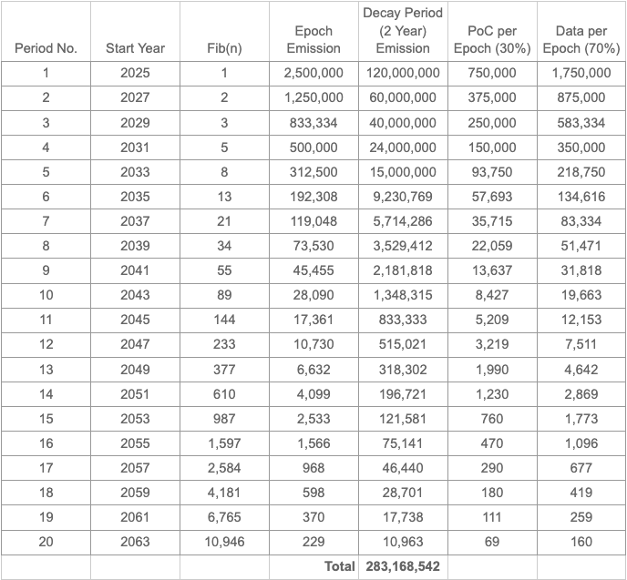
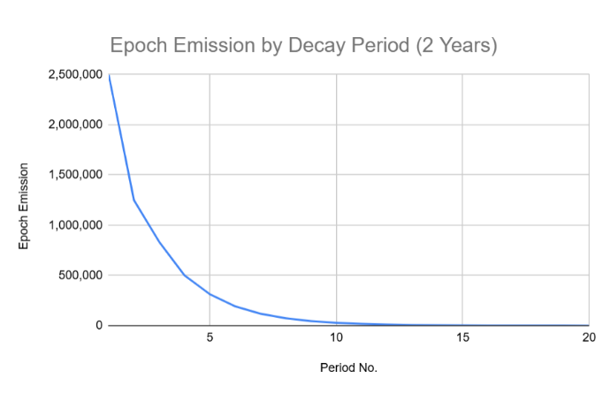

# XIP 11

## Enhanced Tokenomics with Fibonacci‐Based Reduction, Proportional Usage Rewards, and Base Data Threshold

### 1. Introduction
This XIP outlines a revised tokenomics model for the XNET network designed to ensure long-term sustainability, fair distribution, and a healthy token ecosystem. The proposal introduces several key improvements:
- Fibonacci Sequence-Based Emission and Halving: Epoch token emission is reduced within each decay period, and the halving factor every two years is determined by the Fibonacci sequence to mimic the Golden Ratio, resulting in a reduction of a little over half.
- Two-Year Decay Periods: The emission schedule is divided into two-year periods, with a Fibonacci-based reduction at the start of each new decay period.
- Hybrid Reward System: A combination of base rewards (to support smaller operators and ensure minimum data throughput) and proportional usage-based rewards (to incentivize bandwidth provisioning).
- Pool-Based Usage Rewards: Dynamically adjusts the XNET rewards based on a hotspot’s proportion of data offloaded relative to the total network data for the epoch.
- Base Data Threshold for Enhanced Proof of Coverage (PoC) Rewards: Introduces a minimum data offload requirement for hotspots to be eligible for enhanced PoC rewards . There is a small carve-out for general PoC Rewards, meant to reward hotspots prior to carrier registration. However, the majority of the PoC pool will go to hotspots that offload equal to or greater than the base threshold of data. 

### 2. Motivation
The current XNET tokenomics, while effective in bootstrapping network growth, needs refinement to address the following:
- Long-Term Inflation: Unchecked token issuance can lead to inflation and devalue the token over time.
- Fairness and Decentralization: A purely usage-based reward system can disproportionately favor large operators, hindering decentralization.
- Network Participation and Performance: Ensuring consistent network participation and a minimum level of data throughput from all hotspots.
- Token Supply Management: Ensuring the token supply aligns with network growth and doesn’t deplete prematurely.
- This proposal aims to create a more robust and adaptable tokenomics model that aligns incentives, promotes network health, and supports the long-term value of the XNET token.

### 3. Proposed Tokenomics Model

#### 3.1. Epoch  Emission Schedule
- Decay Period-Based Emission: The emission schedule is divided into two-year periods, referred to as “decay periods”.

Fibonacci-Based Emission Reduction (Two-Yearly): At the start of each new decay period (every two years), the initial epoch  emission is reduced by a factor related to consecutive Fibonacci numbers (approximating the Golden Ratio).
The table below summarizes the first 40 years (which may span into multiple decay periods) with their respective Fibonacci numbers, epoch emissions, two-year totals, and the split of PoC vs. Data rewards.
Note: Exact values may vary slightly as the Fibonacci-based reduction is applied. The 40-year total is a rough sum of the epoch emissions in that decay period span.

Given that the Operator Pool has approximately 360M tokens available, as of this document date, this would not use up all of the available tokens. The balance can be used for other rewards purposes in the future.

#### 3.2. Hybrid Reward System
Each epoch’s emission is divided into two pools:
- Base Proof-of-Coverage (PoC) Rewards (5%)
  - 5% of the epoch emission goes to base PoC rewards
  - There is no data threshold to qualify
  - The base pool is split evenly across all WiFi hotspots that are registered on the XNET network and are online during the epoch
- Enhanced Proof-of-Coverage (PoC) Rewards (25%):
  - 25% of the epoch emission goes to PoC rewards.
  - Base Data Threshold: To be eligible for PoC rewards, a hotspot must offload at least 3 GB in the epoch
  - Distribution: Eligible hotspots share the PoC reward pool equally.
- Data Transfer (DT) Rewards (70%):
  - 70% of the epoch emission goes to DT rewards.
  - Proportional Distribution: A hotspot's DT reward is calculated as follows: `Hotspot's DT Reward = (Hotspot’s Data Transferred / Total Network Data) * (DT Reward Pool)`

#### 3.3 Cellular Device Rewards
Currently, the various cellular devices on the network do not process any data. However, they receive PoC rewards based on their measured uptime in any 2-week reward Epoch:
- >=50%:  50% of rewards
- >=75%:  100% of rewards
- >=99%:  110% of rewards
These rewards are varied based on the type of device contributing to the coverage and the type of Hex that they occupy, e.g.:
- BlinQ FW300i - 1500 in Blue hex; 4000 in Silver / Gold
- Baicells Nova 846 - 2000 in Blue hex; 5000 in Silver / Gold
It is proposed that these PoC rewards are incorporated into the PoC rewards pool described above. The amount of the PoC rewards apportioned to the Cellular devices could be done based on a simple ratio of the number of valid Cellular devices (>=50% uptime) over the total number of valid devices (including WiFi devices with >= the median data usage for that Epoch).
After apportioning the total amount of enhanced PoC rewards allocated to Cellular devices, the calculation of PoC token rewards per device would use that total ascribed number and divide it using the existing Device Type and Hex Type methodology; also still recognizing the Uptime band rewards.

### 4. Example Emission Schedule & Reward Distribution
Using Period 1 from the table above, the Epoch Emission is 2,500,000 XNET. This means:
- Base PoC Epoch Rewards (5%): 125,000 XNET
- Enhanced PoC Epoch Rewards (25%): 625,000 XNET
- DT Epoch Rewards (70%): 1,750,000 XNET
#### 4.1. Theoretical Hotspot Reward Simulation
Let us assume:
- Total Network Data for the Epoch: 2,000 GB
- Number of Active Hotspots: 100
- Offload Threshold (to qualify for PoC): 3  GB

Example A: Hotspot Offloads 1 GB
- Base PoC Rewards: All WiFi hotspots qualify for the base PoC rewards, which is split evenly among the 100 active hotspots. Base PoC Reward = 1,250 XNET
- Enhanced PoC Rewards: Since 1 GB is below the 3  GB offload threshold, this hotspot does not qualify for the enhanced PoC pool. Enhanced PoC Reward = 0 XNET
- DT Rewards: The hotspot’s share of total data is 1 / 2000 = 0.05%. DT reward = 0.0005 * 1,750,000 ≈ 875 XNET.
- Total Epoch Reward: 1,250 XNET + 875 XNET = 2,125 XNET

Example B: Hotspot Transfers 20 GB of Data
- Base PoC Rewards: All WiFi hotspots qualify for the base PoC rewards, which is split evenly among the 100 active hotspots. Base PoC Reward = 1,250 XNET
- Enhanced PoC Rewards: 20 GB exceeds the 3 GB offload threshold. Assuming 50 out of 100 hotspots meet or exceed the 3  GB threshold, each eligible hotspot receives an equal share of the PoC rewards pool: 625,000 XNET / 50 hotspots ≈ 12,500 XNET per hotspot.
- Data Transfer (DT) Rewards: The hotspot's share of the total data transferred is 20 GB / 2,000 GB = 1%. The DT reward is: 0.01 * 1,750,000 XNET ≈ 17,500 XNET
- Total Epoch Reward: 1,250 XNET + 12,500 XNET + 17,500 XNET = 31,250 XNET

### 5. Benefits of the Proposed Model
- Sustainable Inflation: Fibonacci-based decays and halving ensure predictable, slowing inflation.
- Fair Distribution: The median threshold (or base offload requirement) maintains decentralization and keeps smaller operators engaged. High-throughput hotspots are rewarded proportionally.
- Incentivized Growth: Usage-based rewards encourage investment in hardware, coverage, and bandwidth capacity.
- Adaptability: Burn ratios and thresholds can be updated via governance to respond to network conditions.

### 6. Implementation Details
- Data Tracking: Must be accurate, transparent, and tamper-resistant.
- Fibonacci Halving Calculation: Each new decay period reduces the emission baseline by a ratio derived from consecutive Fibonacci numbers (e.g., 144/233 ≈ 0.618).
- Governance: Key parameters (emission rate, burn ratio, reward distribution, threshold type, etc.) are governed by the XNET DAO.
- Auditing: The entire tokenomics smart-contract logic will undergo comprehensive audits.
- Sybil Resistance: Proof-of-Coverage validation, staking requirements, and device identity checks help mitigate Sybil attacks.

### 7. Conclusion
This updated XIP proposes a comprehensive, Fibonacci-driven tokenomics framework for XNET. By incorporating:
- Fibonacci sequence-based epoch emission decay and two-year halving events,
- A hybrid reward system combining PoC and usage-based DT rewards,
- A base data threshold to ensure meaningful participation,
…the XNET ecosystem gains:
- Predictable long-term supply control to protect token value,
- Fair distribution that promotes both small and large operators,
- Incentives for real network usage and high-quality service,
- Flexible governance controls to adapt policy as the network evolves.
By adopting these measures, the XNET network positions itself for sustained growth, decentralized participation, and a healthy, value-driven token economy.
